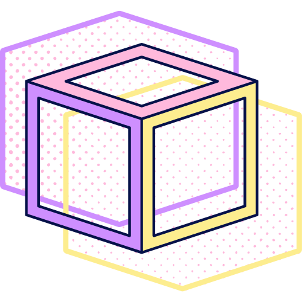

<a name="readme-top"></a>

[![Forks][forks-shield]][forks-url]
[![Stargazers][stars-shield]][stars-url]
[![LinkedIn][linkedin-shield]][linkedin-url]

<!-- PROJECT LOGO -->
<br />
<div align="center">
  <a href="https://github.com/fabiankohlhaas/fullstackopen">
    
  </a>
<h1 align="center">Full Stack Open</h1>

  <!-- <p align="center">
    Repository with my submissions to the University of Helsinkis Full Stack Open 
    Course. -->
</div>

<!-- TABLE OF CONTENTS -->
<details>
  <summary>Table of Contents</summary>
  <ol>
    <li>
      <a href="#about-the-project">About The Project</a>
      <ul>
        <li><a href="#parts">Parts</a></li>
        <li><a href="#built-with">Built With</a></li>
      </ul>
    </li>
    <li>
      <a href="#getting-started">Getting Started</a>
      <ul>
        <li><a href="#prerequisites">Prerequisites</a></li>
        <li><a href="#installation">Installation</a></li>
      </ul>
    </li>
    <li><a href="#contact">Contact</a></li>
    <li><a href="#acknowledgments">Acknowledgments</a></li>
  </ol>
</details>

<!-- ABOUT THE PROJECT -->
## About The Project

This repository contains my submissions for the [Full Stack Open](https://fullstackopen.com/en/)
course from the [University of Helsinki](https://www.helsinki.fi/en).

The course teaches React, Redux, Node.js, MongoDB, GraphQL and TypeScript.
It is an introduction to modern JavaScript-based web development.
It focuses on building single page applications with ReactJS that use REST APIs
built with Node.js.

<p align="right">(<a href="#readme-top">back to top</a>)</p>

### Parts

* [Part 0 Fundamentals of Web apps](./part0/)
* [Part 1 Introduction to React](./part1/)
* [Part 2 Communicating with server](./part2/)

<p align="right">(<a href="#readme-top">back to top</a>)</p>

### Built With

<!-- * [![React][React.js]][React-url]
* [![Next][Next.js]][Next-url]
* [![Vue][Vue.js]][Vue-url]
* [![Angular][Angular.io]][Angular-url] -->
  
* [React](https://reactjs.org/)
* [Redux](https://redux.js.org/)
* [Node.js](https://nodejs.org/en/)
* [MongoDB](https://www.mongodb.com/)

<p align="right">(<a href="#readme-top">back to top</a>)</p>

<!-- GETTING STARTED -->
## Getting Started

The following steps are necessary to run the projects.

### Prerequisites

Install [Node.js](https://nodejs.org/en/) version 16.13.2 or higher:

* Ubuntu:

  ```sh
  sudo apt install nodejs
  ```

* macOS:

  ```sh
  brew install node
  ```

* Windows:
  
  Download the [Windows Installer](https://nodejs.org/en/#home-downloadhead)
  from [nodejs.org](https://nodejs.org)

### Installation

1. Navigate to the folder of the project you'd like to look at in your terminal,
   for Example:

   ```sh
   cd /YOUR-PARRENT-FOLDERS/fullstackopen/part1/anecdotes
   ```

2. Run the following command

   ```sh
   npm start
   ```

<!-- CONTACT -->
## Contact

Project Link: [https://github.com/fabiankohlhaas/fullstackopen](https://github.com/fabiankohlhaas/fullstackopen)

<p align="right">(<a href="#readme-top">back to top</a>)</p>

<!-- ACKNOWLEDGMENTS -->
## Acknowledgments

* [University of Helsinki](https://www.helsinki.fi/en)
* [Full Stack Open](https://fullstackopen.com/en/)
* [Course Partners](https://fullstackopen.com/en/companies)

<p align="right">(<a href="#readme-top">back to top</a>)</p>

<!-- MARKDOWN LINKS & IMAGES -->
<!-- https://www.markdownguide.org/basic-syntax/#reference-style-links -->
[forks-shield]: https://img.shields.io/github/forks/fabiankohlhaas/fullstackopen.svg?style=for-the-badge
[forks-url]: https://github.com/fabiankohlhaas/fullstackopen/network/members
[stars-shield]: https://img.shields.io/github/stars/fabiankohlhaas/fullstackopen.svg?style=for-the-badge
[stars-url]: https://github.com/fabiankohlhaas/fullstackopen/stargazers
[linkedin-shield]: https://img.shields.io/badge/-LinkedIn-black.svg?style=for-the-badge&logo=linkedin&colorB=555
[linkedin-url]: https://linkedin.com/in/fako/

<!-- [product-screenshot]: images/screenshot.png -->