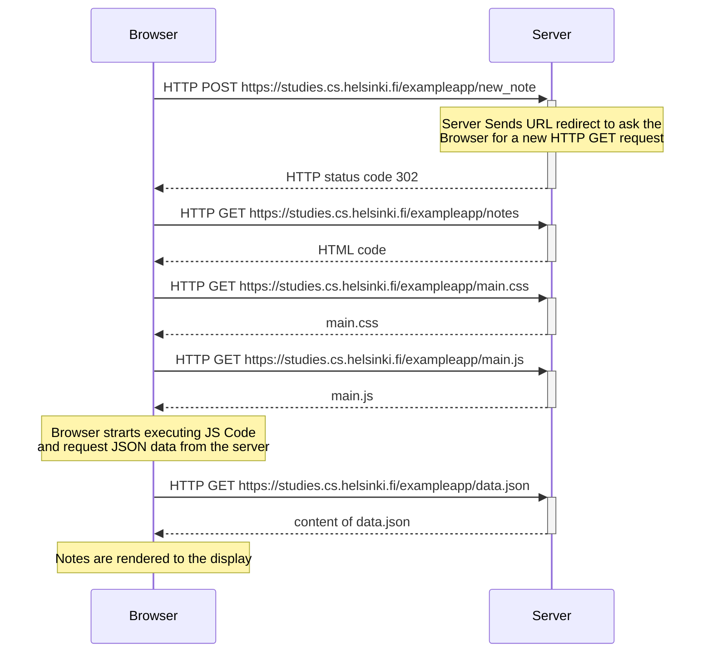

# New note diagram

```mermaid
sequenceDiagram
    Browser->>+Server: HTTP POST https://studies.cs.helsinki.fi/exampleapp/new_note
    Note over Server: Server Sends URL redirect to ask the <br> Browser for a new HTTP GET request
    Server-->>-Browser: HTTP status code 302
    Browser->>+Server: HTTP GET https://studies.cs.helsinki.fi/exampleapp/notes
    Server-->>-Browser: HTML code
    Browser->>+Server: HTTP GET https://studies.cs.helsinki.fi/exampleapp/main.css
    Server-->>-Browser: main.css
    Browser->>+Server: HTTP GET https://studies.cs.helsinki.fi/exampleapp/main.js
    Server-->>-Browser: main.js
    Note over Browser: Browser strarts executing JS Code <br> and request JSON data from the server
    Browser->>+Server: HTTP GET https://studies.cs.helsinki.fi/exampleapp/data.json 
    Server-->>-Browser: content of data.json
    Note over Browser: Notes are rendered to the display
```
