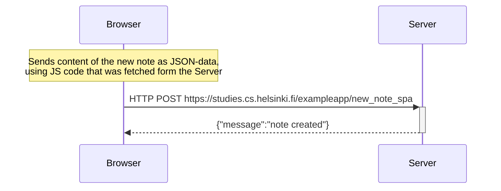

# Single page app diagram

```mermaid
        sequenceDiagram
        Note over Browser: Sends content of the new note as JSON-data, <br> using JS code that was fetched form the Server
        Browser->>+Server: HTTP POST https://studies.cs.helsinki.fi/exampleapp/new_note_spa
        Server-->>-Browser: {"message":"note created"}
```
